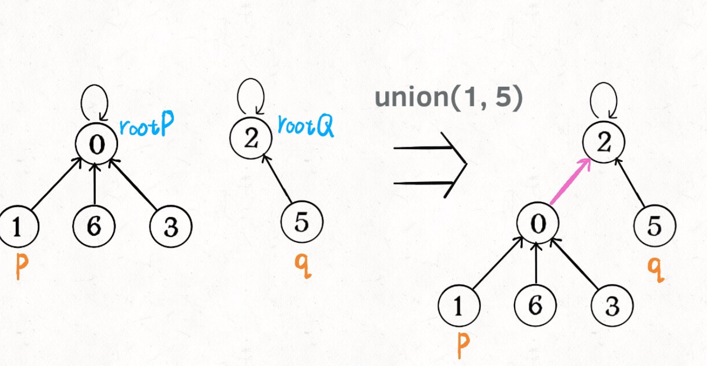

##并查集

####基本结构


1. [不带权值的并查集](https://leetcode-cn.com/problems/surrounded-regions/)
```python
from typing import *
from collections import *
class Solution:
    # 并查集的构造
    class UF:
        def __init__(self,n):
            self.count = n
            self.parent = defaultdict(int)
            for i in range(n):
                self.parent[i] = i
        
        def find(self,x):
            while x!= self.parent[x]:
                self.parent[x] = self.parent[self.parent[x]]
                x = self.parent[x]
            return x

        def union(self,p,q):
            rootQ = self.find(q)
            rootP = self.find(p)
            if rootP!=rootQ:
                self.parent[rootP] = rootQ

        def connected(self,p,q):
            rootP = self.find(p)
            rootQ = self.find(q)
            return rootP == rootQ

    def solve(self, board: List[List[str]]) -> None:
        """
        Do not return anything, modify board in-place instead.
        """
        m,n = len(board),len(board[0])
        uf = self.UF(m*n+1)
        ij2index = lambda n,i,j:i*n+j
        dummy = m*n #所有边界为O的公共祖先dummy
        # 将边界为O的点，添加到dummy的树下
        for j in range(n):
            if board[0][j]=='O':
                uf.union(ij2index(n,0,j),dummy)
            if board[m-1][j]=='O':
                uf.union(ij2index(n,m-1,j),dummy)
        for i in range(1,m-1):
            if board[i][0]=='O':
                uf.union(ij2index(n,i,0),dummy)
            if board[i][n-1]=='O':
                uf.union(ij2index(n,i,n-1),dummy)
        #  将相通的O连结起来       
        actionx = [0,0,1,-1];actiony = [1,-1,0,0]
        for i in range(1,m-1):
            for j in range(1,n-1):
                if board[i][j]=='O':
                    for k in range(4):
                        newi = i+actionx[k]
                        newj = j+actiony[k]
                        if board[newi][newj]=='O':
                            uf.union(ij2index(n,newi,newj),ij2index(n,i,j))
        for i in range(m):
            for j in range(n):
                if board[i][j]=='O':
                    # 只要没和dummy连结的，就表明没和边界O连结，即需要改成X
                    if not uf.connected(ij2index(n,i,j),dummy):board[i][j]='X'
```
2. [带权值的并查集](https://leetcode-cn.com/problems/vlzXQL/submissions/)
```python
from typing import *
class Solution:
    # 构造并查集
    class UF:
        def __init__(self,n):
            self.parent = [None]*n
            self.multi = [1.0]*n
            for i in range(n):
                self.parent[i] = i

        def find(self,x):
            if x!=self.parent[x]:
                # find时利用递归更新权值
                parent = self.parent[x]
                self.parent[x] = self.find(self.parent[x])
                muti_num = self.multi[parent]
                self.multi[x] *= muti_num
            return self.parent[x]

        def union(self,x,y,muti_num):
            rootX = self.find(x)
            rootY = self.find(y)
            if rootX!=rootY:
                self.parent[rootY] = rootX
                # 连结时更新两个根节点的权值
                self.multi[rootY] = self.multi[x]*muti_num/self.multi[y]
        
        def connected(self,x,y):
            rootX = self.find(x)
            rootY = self.find(y)
            return rootX==rootY

    def calcEquation(self, equations: List[List[str]], values: List[float], queries: List[List[str]]) -> List[float]:
        str2index = dict()
        ind = 0
        for equ in equations:
            for k in equ:
                if k not in str2index:
                    str2index[k] = ind
                    ind+=1

        uf = self.UF(ind)

        for i,equ in enumerate(equations):
            muti_num = values[i]
            x,y = str2index[equ[0]],str2index[equ[1]]
            uf.union(x,y,muti_num)

        res = []
      
        for x,y in queries:
            if x not in str2index or y not in str2index:
                res.append(-1.0)
                continue
            x,y = str2index[x],str2index[y]
            if not uf.connected(x,y):
                res.append(-1.0)
            else:
                # 懒加载更新子节点权值
                uf.find(y)
                uf.find(x)
                res.append(uf.multi[y]/uf.multi[x])

        return res
```